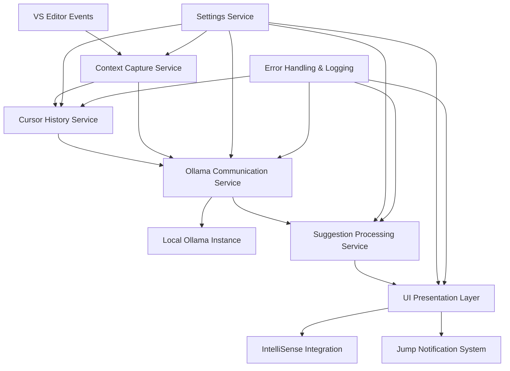

# Design Document

## Overview

The VS2022 Ollama Assistant is a Visual Studio 2022 extension that provides intelligent code completion and navigation assistance using Ollama AI models. The extension integrates seamlessly with Visual Studio's editor infrastructure to capture typing context, communicate with local Ollama instances, and present suggestions through familiar UI patterns.

The extension follows Visual Studio's asynchronous programming patterns and leverages the Visual Studio SDK's editor services for text manipulation and UI integration. It maintains a lightweight footprint while providing responsive AI-powered assistance.

## Architecture

### High-Level Architecture



### Component Architecture

The extension follows a modular architecture with clear separation of concerns:

1. **Editor Integration Layer**: Handles Visual Studio editor events and text buffer manipulation
2. **Context Analysis Layer**: Processes cursor position and configurable surrounding code context
3. **Cursor History Layer**: Tracks and manages cursor position history across files
4. **AI Communication Layer**: Manages HTTP communication with Ollama API
5. **Suggestion Engine**: Processes AI responses with historical context and determines relevance
6. **UI Presentation Layer**: Manages IntelliSense integration and jump notifications
7. **Configuration Layer**: Handles user settings including context lines and history depth
8. **Infrastructure Layer**: Provides logging, error handling, and lifecycle management

## Components and Interfaces

### 1. Editor Integration Components

#### ITextViewService
```csharp
public interface ITextViewService
{
    event EventHandler<TextChangedEventArgs> TextChanged;
    event EventHandler<CaretPositionChangedEventArgs> CaretPositionChanged;
    
    Task<string> GetSurroundingContextAsync(int linesUp, int linesDown);
    Task InsertTextAsync(string text, int position);
    SnapshotPoint GetCaretPosition();
}
```

#### IContextCaptureService
```csharp
public interface IContextCaptureService
{
    Task<CodeContext> CaptureContextAsync(SnapshotPoint caretPosition, int linesUp, int linesDown);
    Task<JumpRecommendation> AnalyzeJumpOpportunitiesAsync(ITextSnapshot snapshot, SnapshotPoint caretPosition);
}
```

#### ICursorHistoryService
```csharp
public interface ICursorHistoryService
{
    void RecordCursorPosition(string filePath, SnapshotPoint position, string contextSnippet);
    IEnumerable<CursorHistoryEntry> GetRecentHistory(int maxEntries);
    void ClearHistory();
    event EventHandler<CursorHistoryChangedEventArgs> HistoryChanged;
}
```

### 2. AI Communication Components

#### IOllamaService
```csharp
public interface IOllamaService
{
    Task<string> GetCompletionAsync(string prompt, string context, List<CursorHistoryEntry> history, CancellationToken cancellationToken);
    Task<bool> IsAvailableAsync();
    Task<ModelInfo> GetModelInfoAsync();
}
```

#### OllamaHttpClient
- Handles HTTP communication with Ollama API
- Implements retry logic and timeout handling
- Manages connection pooling and disposal

### 3. Suggestion Processing Components

#### ISuggestionEngine
```csharp
public interface ISuggestionEngine
{
    Task<CodeSuggestion> ProcessSuggestionAsync(string aiResponse, CodeContext context);
    bool ShouldShowSuggestion(CodeSuggestion suggestion, CodeContext context);
    Task<JumpRecommendation> ProcessJumpSuggestionAsync(CodeContext context);
}
```

#### CodeSuggestion
```csharp
public class CodeSuggestion
{
    public string Text { get; set; }
    public int InsertionPoint { get; set; }
    public double Confidence { get; set; }
    public SuggestionType Type { get; set; }
}
```

### 4. UI Components

#### IIntelliSenseIntegration
```csharp
public interface IIntelliSenseIntegration
{
    Task ShowSuggestionAsync(CodeSuggestion suggestion);
    void DismissSuggestion();
    event EventHandler<SuggestionAcceptedEventArgs> SuggestionAccepted;
}
```

#### IJumpNotificationService
```csharp
public interface IJumpNotificationService
{
    Task ShowJumpNotificationAsync(JumpRecommendation recommendation);
    void HideJumpNotification();
    event EventHandler<JumpExecutedEventArgs> JumpExecuted;
}
```

### 5. Configuration Components

#### ISettingsService
```csharp
public interface ISettingsService
{
    string OllamaEndpoint { get; set; }
    int SurroundingLinesUp { get; set; }
    int SurroundingLinesDown { get; set; }
    Keys JumpKey { get; set; }
    bool CodePredictionEnabled { get; set; }
    bool JumpRecommendationsEnabled { get; set; }
    int CursorHistoryMemoryDepth { get; set; }
    
    event EventHandler<SettingsChangedEventArgs> SettingsChanged;
}
```

## Data Models

### CodeContext
```csharp
public class CodeContext
{
    public string FileName { get; set; }
    public string Language { get; set; }
    public string[] PrecedingLines { get; set; }
    public string CurrentLine { get; set; }
    public string[] FollowingLines { get; set; }
    public int CaretPosition { get; set; }
    public int LineNumber { get; set; }
    public string CurrentScope { get; set; }
    public IndentationInfo Indentation { get; set; }
    public List<CursorHistoryEntry> CursorHistory { get; set; }
}
```

### CursorHistoryEntry
```csharp
public class CursorHistoryEntry
{
    public string FilePath { get; set; }
    public int LineNumber { get; set; }
    public int Column { get; set; }
    public string ContextSnippet { get; set; }
    public DateTime Timestamp { get; set; }
    public string ChangeType { get; set; } // e.g., "edit", "navigation", "jump"
}
```

### JumpRecommendation
```csharp
public class JumpRecommendation
{
    public int TargetLine { get; set; }
    public int TargetColumn { get; set; }
    public JumpDirection Direction { get; set; }
    public string Reason { get; set; }
    public double Confidence { get; set; }
}

public enum JumpDirection
{
    Up,
    Down,
    None
}
```

### OllamaRequest
```csharp
public class OllamaRequest
{
    public string Model { get; set; }
    public string Prompt { get; set; }
    public OllamaOptions Options { get; set; }
    public bool Stream { get; set; }
}
```

## Error Handling

### Exception Hierarchy
- `OllamaExtensionException` (base exception)
  - `OllamaConnectionException` (network/connection issues)
  - `OllamaModelException` (model-related errors)
  - `ContextCaptureException` (editor context issues)
  - `SuggestionProcessingException` (suggestion processing errors)

### Error Handling Strategy
1. **Network Errors**: Graceful degradation with user notification
2. **Model Errors**: Fallback to basic suggestions or disable temporarily
3. **Editor Errors**: Log and continue without crashing VS
4. **Configuration Errors**: Use default settings and notify user

### Logging
- Use Visual Studio's `IVsActivityLog` for integration with VS diagnostics
- Implement structured logging with different levels (Debug, Info, Warning, Error)
- Include correlation IDs for tracking request flows
- Log performance metrics for optimization

## Testing Strategy

### Unit Testing
- **Framework**: MSTest with Moq for mocking
- **Coverage**: All service classes and business logic
- **Focus Areas**:
  - Context capture logic
  - Suggestion processing algorithms
  - Ollama communication handling
  - Settings management

### Integration Testing
- **VS Integration**: Test with Visual Studio SDK test framework
- **Ollama Integration**: Test against local Ollama instance
- **Editor Integration**: Test text manipulation and UI updates

### Performance Testing
- **Response Time**: Measure suggestion generation time
- **Memory Usage**: Monitor extension memory footprint
- **Network Performance**: Test with various network conditions

### Manual Testing
- **User Experience**: Test suggestion quality and relevance
- **UI Integration**: Verify IntelliSense and notification behavior
- **Configuration**: Test all settings combinations

## Implementation Considerations

### Threading and Async Patterns
- Use `async/await` throughout for non-blocking operations
- Implement proper cancellation token usage
- Use `ConfigureAwait(false)` for library code
- Leverage Visual Studio's `JoinableTaskFactory` for UI thread marshaling

### Performance Optimization
- **Debouncing**: Implement typing debounce to reduce API calls
- **Caching**: Cache recent suggestions and context analysis
- **Lazy Loading**: Initialize services on-demand
- **Connection Pooling**: Reuse HTTP connections to Ollama
- **History Management**: Implement efficient circular buffer for cursor history with configurable depth
- **Context Pruning**: Intelligently select relevant history entries based on file relationships

### Security Considerations
- **Input Validation**: Sanitize all code context before sending to Ollama
- **Network Security**: Use HTTPS when possible, validate certificates
- **Data Privacy**: Ensure no sensitive data is logged or transmitted unnecessarily
- **Resource Limits**: Implement timeouts and request size limits

### Visual Studio Integration
- **Package Definition**: Use AsyncPackage for proper async initialization
- **Command Handling**: Implement commands through OleMenuCommand
- **Editor Services**: Use MEF composition for editor service integration
- **Settings Storage**: Use Visual Studio's settings store for persistence

### Ollama Integration
- **API Compatibility**: Support Ollama's REST API format
- **Model Management**: Allow users to specify preferred models
- **Streaming**: Support streaming responses for better perceived performance
- **Health Checks**: Implement periodic health checks for Ollama availability