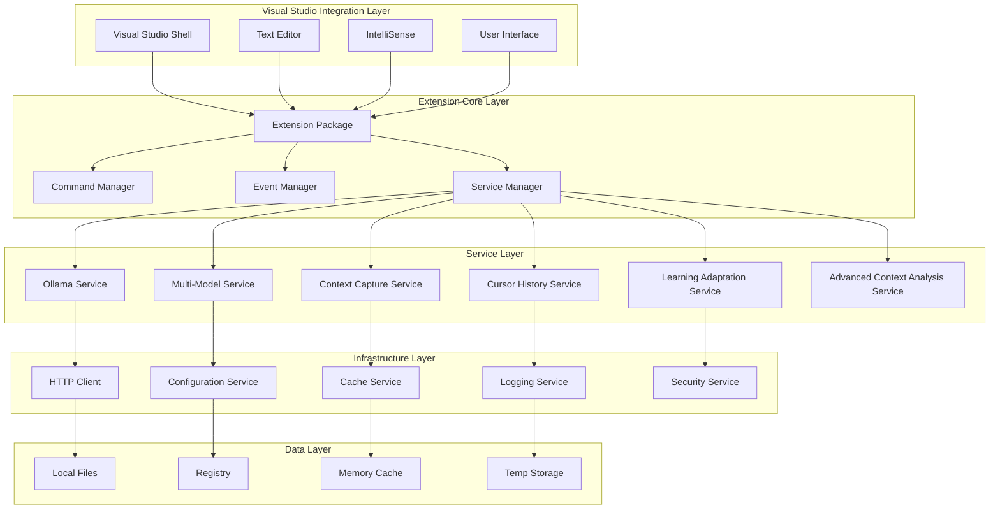
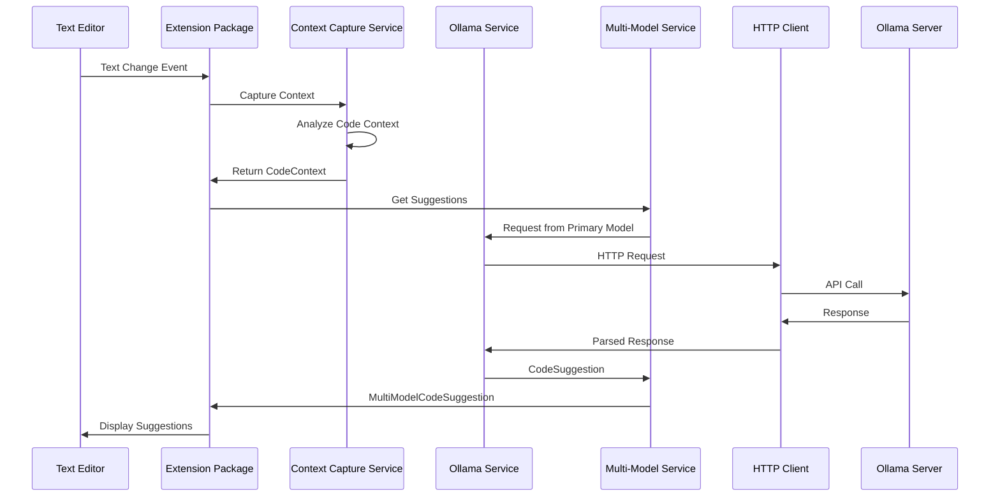
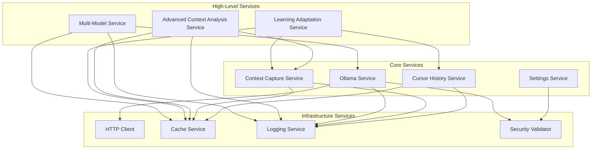

# Ollama Assistant Extension Architecture

## Overview

The Ollama Assistant is a sophisticated Visual Studio 2022 extension built with a modular, layered architecture designed for scalability, maintainability, and performance. This document provides a comprehensive overview of the system architecture, component relationships, and design patterns.

## Architecture Principles

### Core Design Principles

1. **Separation of Concerns**: Clear boundaries between different system responsibilities
2. **Dependency Injection**: Loose coupling through IoC container usage
3. **Asynchronous Processing**: Non-blocking operations throughout the system
4. **Extensibility**: Plugin-based architecture for future enhancements
5. **Testability**: Comprehensive unit and integration testing support
6. **Performance**: Optimized for minimal impact on Visual Studio performance

### Architectural Patterns

- **Layered Architecture**: Clear separation between presentation, business, and data layers
- **Service-Oriented Architecture**: Modular services with well-defined interfaces
- **Observer Pattern**: Event-driven communication between components
- **Strategy Pattern**: Pluggable algorithms for model selection and optimization
- **Factory Pattern**: Dynamic creation of service implementations
- **Repository Pattern**: Abstracted data access and persistence

## System Overview



## Layer Details

### 1. Visual Studio Integration Layer

**Purpose**: Direct integration with Visual Studio IDE components

**Components**:
- **Visual Studio Shell**: Main VS integration point
- **Text Editor**: Code editing and manipulation
- **IntelliSense**: Code completion integration
- **User Interface**: Dialogs, windows, and controls

**Responsibilities**:
- Handle Visual Studio events and commands
- Integrate with IntelliSense completion system
- Provide user interface components
- Manage keyboard shortcuts and menu items

**Key Classes**:
```csharp
// Extension package and initialization
public sealed class OllamaAssistantPackage : AsyncPackage
{
    // Package initialization and service registration
}

// Text view integration
public class TextViewManager : IWpfTextViewCreationListener
{
    // Text editor event handling and integration
}

// IntelliSense completion source
public class OllamaCompletionSource : IAsyncQuickInfoSource
{
    // Completion item generation and presentation
}
```

### 2. Extension Core Layer

**Purpose**: Core extension logic and coordination

**Components**:
- **Extension Package**: Main entry point and service container
- **Command Manager**: Command routing and execution
- **Event Manager**: Event handling and coordination
- **Service Manager**: Service lifecycle and dependency management

**Responsibilities**:
- Initialize and configure the extension
- Coordinate between different system components
- Handle Visual Studio integration lifecycle
- Manage service dependencies and injection

**Key Interfaces**:
```csharp
public interface IServiceManager
{
    T GetService<T>() where T : class;
    void RegisterService<TInterface, TImplementation>()
        where TImplementation : class, TInterface;
}

public interface ICommandManager
{
    Task ExecuteCommandAsync(string commandId, object parameter = null);
    void RegisterCommand(string commandId, Func<object, Task> handler);
}

public interface IEventManager
{
    void Subscribe<T>(Action<T> handler) where T : class;
    void Publish<T>(T eventData) where T : class;
}
```

### 3. Service Layer

**Purpose**: Business logic and AI integration services

#### Core Services

**OllamaService** - Primary AI integration service
```csharp
public interface IOllamaService
{
    Task<CodeSuggestion> GetCodeSuggestionAsync(CodeContext context, CancellationToken cancellationToken = default);
    Task<bool> TestConnectionAsync();
    Task<List<string>> GetAvailableModelsAsync();
}
```

**ContextCaptureService** - Code context analysis and capture
```csharp
public interface IContextCaptureService
{
    Task<CodeContext> CaptureContextAsync(string filePath, int line, int column);
    CodeContext OptimizeContext(CodeContext context, int maxTokens);
}
```

**CursorHistoryService** - Cursor position tracking and history
```csharp
public interface ICursorHistoryService
{
    void AddCursorPosition(CursorPosition position);
    List<CursorPosition> GetRecentHistory(int maxEntries = 10);
    void ClearHistory();
}
```

#### Advanced Services

**MultiModelService** - Multiple AI model management
```csharp
public interface IMultiModelService
{
    Task<MultiModelCodeSuggestion> GetCodeSuggestionAsync(CodeContext context, ModelSelectionHint hint = null);
    Task<ModelSwitchResult> SwitchToModelAsync(string modelName, string reason = null);
    MultiModelPerformanceReport GetPerformanceReport();
}
```

**LearningAdaptationService** - User learning and personalization
```csharp
public interface ILearningAdaptationService
{
    Task RecordSuggestionFeedbackAsync(SuggestionFeedback feedback);
    Task<PersonalizedSuggestions> GetPersonalizedSuggestionsAsync(CodeContext context);
    Task<UsageInsights> GetUsageInsightsAsync();
}
```

**AdvancedContextAnalysisService** - Semantic code analysis
```csharp
public interface IAdvancedContextAnalysisService
{
    Task<AdvancedCodeContext> AnalyzeContextAsync(string filePath, int line, int column);
    Task<List<RelatedCodeSection>> FindRelatedCodeAsync(string filePath, int line, int column);
}
```

### 4. Infrastructure Layer

**Purpose**: Cross-cutting concerns and system utilities

**Components**:
- **HTTP Client**: Network communication with Ollama server
- **Cache Service**: In-memory and persistent caching
- **Logging Service**: Structured logging and diagnostics
- **Configuration Service**: Settings management and persistence
- **Security Service**: Input validation and sanitization

**Key Services**:

**CacheService** - Generic caching with TTL support
```csharp
public interface ICacheService<TKey, TValue>
{
    bool TryGet(TKey key, out TValue value);
    void Set(TKey key, TValue value, TimeSpan? expiration = null);
    Task<TValue> GetOrAddAsync(TKey key, Func<TKey, Task<TValue>> factory);
}
```

**LoggingService** - Structured logging with correlation
```csharp
public interface ILoggingService
{
    void LogDebug(string message, object data = null);
    void LogInfo(string message, object data = null);
    void LogWarning(string message, Exception exception = null);
    void LogError(string message, Exception exception = null);
}
```

**SecurityValidator** - Input validation and sanitization
```csharp
public interface ISecurityValidator
{
    ValidationResult ValidateCodeContext(string code);
    string SanitizeInput(string input);
    bool IsPathTraversalAttempt(string path);
}
```

### 5. Data Layer

**Purpose**: Data persistence and storage abstraction

**Storage Mechanisms**:
- **Local Files**: Configuration files, learning data, cache
- **Registry**: Visual Studio settings integration
- **Memory Cache**: High-performance in-memory storage
- **Temp Storage**: Temporary files and diagnostic data

**Data Access Patterns**:
```csharp
public interface IDataRepository<T>
{
    Task<T> GetAsync(string key);
    Task SaveAsync(string key, T data);
    Task DeleteAsync(string key);
    Task<IEnumerable<T>> GetAllAsync();
}

public interface ISettingsRepository
{
    T GetSetting<T>(string key, T defaultValue = default);
    void SetSetting<T>(string key, T value);
    void SaveSettings();
}
```

## Component Interactions

### Request Flow Example: Code Completion



### Service Dependencies



## Design Patterns Implementation

### 1. Dependency Injection

**Container Configuration**:
```csharp
public class ServiceContainer : IServiceContainer
{
    private readonly Dictionary<Type, object> _services = new();
    private readonly Dictionary<Type, Func<object>> _factories = new();

    public void RegisterSingleton<TInterface, TImplementation>()
        where TImplementation : class, TInterface, new()
    {
        _factories[typeof(TInterface)] = () => new TImplementation();
    }

    public T GetService<T>() where T : class
    {
        var type = typeof(T);
        if (_services.TryGetValue(type, out var service))
            return (T)service;

        if (_factories.TryGetValue(type, out var factory))
        {
            service = factory();
            _services[type] = service;
            return (T)service;
        }

        throw new InvalidOperationException($"Service {type.Name} not registered");
    }
}
```

### 2. Strategy Pattern for Model Selection

**Model Selection Strategy**:
```csharp
public interface IModelSelectionStrategy
{
    Task<string> SelectModelAsync(CodeContext context, List<string> availableModels);
}

public class ContextBasedSelectionStrategy : IModelSelectionStrategy
{
    public async Task<string> SelectModelAsync(CodeContext context, List<string> availableModels)
    {
        // Strategy implementation for context-based selection
        return context.Language switch
        {
            "csharp" => "codellama",
            "javascript" => "mistral",
            "python" => "deepseek-coder",
            _ => availableModels.FirstOrDefault() ?? "codellama"
        };
    }
}
```

### 3. Observer Pattern for Events

**Event System**:
```csharp
public interface IEventBus
{
    void Subscribe<T>(IEventHandler<T> handler) where T : IEvent;
    void Publish<T>(T eventData) where T : IEvent;
}

public interface IEvent
{
    DateTime Timestamp { get; }
    string CorrelationId { get; }
}

public interface IEventHandler<T> where T : IEvent
{
    Task HandleAsync(T eventData);
}

// Example event
public class SuggestionAcceptedEvent : IEvent
{
    public DateTime Timestamp { get; set; } = DateTime.UtcNow;
    public string CorrelationId { get; set; } = Guid.NewGuid().ToString();
    public string SuggestionText { get; set; }
    public string ModelUsed { get; set; }
    public CodeContext Context { get; set; }
}
```

### 4. Factory Pattern for Service Creation

**Service Factory**:
```csharp
public interface IServiceFactory<T>
{
    T CreateService(string serviceType, IServiceProvider serviceProvider);
}

public class OllamaServiceFactory : IServiceFactory<IOllamaService>
{
    public IOllamaService CreateService(string serviceType, IServiceProvider serviceProvider)
    {
        return serviceType switch
        {
            "standard" => new OllamaService(
                serviceProvider.GetService<IHttpClient>(),
                serviceProvider.GetService<ILoggingService>()),
            "cached" => new CachedOllamaService(
                serviceProvider.GetService<IOllamaService>(),
                serviceProvider.GetService<ICacheService<string, CodeSuggestion>>()),
            _ => throw new ArgumentException($"Unknown service type: {serviceType}")
        };
    }
}
```

## Performance Considerations

### 1. Asynchronous Operations

**Async/Await Pattern**:
```csharp
public async Task<CodeSuggestion> GetSuggestionAsync(CodeContext context)
{
    // All I/O operations are async
    var cachedResult = await _cache.GetAsync(context.GetCacheKey());
    if (cachedResult != null)
        return cachedResult;

    var suggestion = await _ollamaService.GetSuggestionAsync(context);
    await _cache.SetAsync(context.GetCacheKey(), suggestion, TimeSpan.FromMinutes(5));
    
    return suggestion;
}
```

### 2. Caching Strategy

**Multi-Level Caching**:
```csharp
public class MultiLevelCacheService<TKey, TValue> : ICacheService<TKey, TValue>
{
    private readonly IMemoryCache _l1Cache;    // Fast in-memory cache
    private readonly IFileCache _l2Cache;      // Persistent file cache
    private readonly TimeSpan _l1Ttl;
    private readonly TimeSpan _l2Ttl;

    public async Task<TValue> GetOrAddAsync(TKey key, Func<TKey, Task<TValue>> factory)
    {
        // Check L1 cache first
        if (_l1Cache.TryGet(key, out var l1Value))
            return l1Value;

        // Check L2 cache
        var l2Value = await _l2Cache.GetAsync(key);
        if (l2Value != null)
        {
            _l1Cache.Set(key, l2Value, _l1Ttl);
            return l2Value;
        }

        // Generate new value
        var newValue = await factory(key);
        
        // Cache at both levels
        _l1Cache.Set(key, newValue, _l1Ttl);
        await _l2Cache.SetAsync(key, newValue, _l2Ttl);
        
        return newValue;
    }
}
```

### 3. Background Processing

**Background Task Queue**:
```csharp
public class BackgroundTaskQueue : IBackgroundTaskQueue
{
    private readonly Channel<Func<CancellationToken, Task>> _queue;
    private readonly ChannelReader<Func<CancellationToken, Task>> _reader;
    private readonly ChannelWriter<Func<CancellationToken, Task>> _writer;

    public BackgroundTaskQueue(int capacity = 100)
    {
        var options = new BoundedChannelOptions(capacity)
        {
            FullMode = BoundedChannelFullMode.Wait
        };

        _queue = Channel.CreateBounded<Func<CancellationToken, Task>>(options);
        _reader = _queue.Reader;
        _writer = _queue.Writer;
    }

    public async ValueTask QueueBackgroundWorkItemAsync(Func<CancellationToken, Task> workItem)
    {
        await _writer.WriteAsync(workItem);
    }

    public async ValueTask<Func<CancellationToken, Task>> DequeueAsync(CancellationToken cancellationToken)
    {
        return await _reader.ReadAsync(cancellationToken);
    }
}
```

## Error Handling and Resilience

### 1. Circuit Breaker Pattern

**Circuit Breaker Implementation**:
```csharp
public class CircuitBreaker
{
    private readonly int _failureThreshold;
    private readonly TimeSpan _timeout;
    private int _failureCount;
    private DateTime _lastFailureTime;
    private CircuitBreakerState _state;

    public async Task<T> ExecuteAsync<T>(Func<Task<T>> operation)
    {
        if (_state == CircuitBreakerState.Open)
        {
            if (DateTime.UtcNow - _lastFailureTime > _timeout)
            {
                _state = CircuitBreakerState.HalfOpen;
            }
            else
            {
                throw new CircuitBreakerOpenException();
            }
        }

        try
        {
            var result = await operation();
            Reset();
            return result;
        }
        catch (Exception ex)
        {
            RecordFailure();
            throw;
        }
    }

    private void RecordFailure()
    {
        _failureCount++;
        _lastFailureTime = DateTime.UtcNow;

        if (_failureCount >= _failureThreshold)
        {
            _state = CircuitBreakerState.Open;
        }
    }

    private void Reset()
    {
        _failureCount = 0;
        _state = CircuitBreakerState.Closed;
    }
}
```

### 2. Retry Policy

**Exponential Backoff Retry**:
```csharp
public class RetryPolicy
{
    private readonly int _maxRetries;
    private readonly TimeSpan _baseDelay;

    public async Task<T> ExecuteAsync<T>(Func<Task<T>> operation)
    {
        var attempt = 0;
        while (true)
        {
            try
            {
                return await operation();
            }
            catch (Exception ex) when (ShouldRetry(ex, attempt))
            {
                attempt++;
                var delay = TimeSpan.FromMilliseconds(
                    _baseDelay.TotalMilliseconds * Math.Pow(2, attempt - 1));
                await Task.Delay(delay);
            }
        }
    }

    private bool ShouldRetry(Exception exception, int attempt)
    {
        return attempt < _maxRetries && IsTransientException(exception);
    }

    private bool IsTransientException(Exception exception)
    {
        return exception is HttpRequestException ||
               exception is TaskCanceledException ||
               exception is SocketException;
    }
}
```

## Security Architecture

### 1. Input Validation Pipeline

**Validation Chain**:
```csharp
public class ValidationPipeline
{
    private readonly List<IValidator> _validators;

    public ValidationResult Validate(object input)
    {
        var context = new ValidationContext(input);
        
        foreach (var validator in _validators)
        {
            var result = validator.Validate(context);
            if (!result.IsValid)
                return result;
            
            context.UpdateInput(result.SanitizedInput);
        }

        return ValidationResult.Success(context.Input);
    }
}

public class CodeContextValidator : IValidator
{
    public ValidationResult Validate(ValidationContext context)
    {
        if (context.Input is not CodeContext codeContext)
            return ValidationResult.Failure("Invalid input type");

        // Validate context size
        if (GetContextSize(codeContext) > MaxContextSize)
            return ValidationResult.Failure("Context too large");

        // Sanitize code content
        var sanitizedContext = SanitizeCodeContext(codeContext);
        
        return ValidationResult.Success(sanitizedContext);
    }
}
```

### 2. Secure Communication

**HTTPS and Certificate Validation**:
```csharp
public class SecureHttpClient : IHttpClient
{
    private readonly HttpClient _httpClient;

    public SecureHttpClient(HttpClientOptions options)
    {
        var handler = new HttpClientHandler();
        
        if (options.ValidateCertificates)
        {
            handler.ServerCertificateCustomValidationCallback = 
                ValidateServerCertificate;
        }

        _httpClient = new HttpClient(handler);
        
        if (!string.IsNullOrEmpty(options.ApiKey))
        {
            _httpClient.DefaultRequestHeaders.Add("Authorization", 
                $"Bearer {options.ApiKey}");
        }
    }

    private bool ValidateServerCertificate(
        HttpRequestMessage request,
        X509Certificate2 certificate,
        X509Chain chain,
        SslPolicyErrors errors)
    {
        // Custom certificate validation logic
        return errors == SslPolicyErrors.None || 
               IsAcceptableCertificateError(errors);
    }
}
```

## Testing Architecture

### 1. Test Structure

**Test Organization**:
```
Tests/
├── Unit/
│   ├── Services/
│   │   ├── OllamaServiceTests.cs
│   │   ├── ContextCaptureServiceTests.cs
│   │   └── MultiModelServiceTests.cs
│   ├── Infrastructure/
│   │   ├── CacheServiceTests.cs
│   │   └── SecurityValidatorTests.cs
│   └── Utilities/
├── Integration/
│   ├── VisualStudioIntegrationTests.cs
│   ├── OllamaServerIntegrationTests.cs
│   └── EndToEndTests.cs
├── Performance/
│   ├── PerformanceBenchmarks.cs
│   └── LoadTests.cs
└── TestUtilities/
    ├── MockServices/
    ├── TestData/
    └── Fixtures/
```

### 2. Test Patterns

**Service Testing with Mocks**:
```csharp
[TestClass]
public class OllamaServiceTests
{
    private Mock<IHttpClient> _mockHttpClient;
    private Mock<ILoggingService> _mockLogger;
    private Mock<ISecurityValidator> _mockValidator;
    private OllamaService _service;

    [TestInitialize]
    public void Setup()
    {
        _mockHttpClient = new Mock<IHttpClient>();
        _mockLogger = new Mock<ILoggingService>();
        _mockValidator = new Mock<ISecurityValidator>();
        
        _service = new OllamaService(
            _mockHttpClient.Object,
            _mockLogger.Object,
            _mockValidator.Object);
    }

    [TestMethod]
    public async Task GetCodeSuggestionAsync_ValidContext_ReturnsSuggestion()
    {
        // Arrange
        var context = CreateTestCodeContext();
        var expectedResponse = CreateTestOllamaResponse();
        
        _mockHttpClient
            .Setup(x => x.PostAsync(It.IsAny<string>(), It.IsAny<object>()))
            .ReturnsAsync(expectedResponse);

        _mockValidator
            .Setup(x => x.ValidateCodeContext(It.IsAny<string>()))
            .Returns(ValidationResult.Success());

        // Act
        var result = await _service.GetCodeSuggestionAsync(context);

        // Assert
        Assert.IsNotNull(result);
        Assert.AreEqual(expectedResponse.Text, result.Text);
        _mockLogger.Verify(x => x.LogDebug(It.IsAny<string>(), It.IsAny<object>()), Times.Once);
    }
}
```

### 3. Integration Testing

**VS Integration Testing**:
```csharp
[TestClass]
public class VisualStudioIntegrationTests : IAsyncLifetime
{
    private TestHarness _testHarness;

    [TestInitialize]
    public async Task InitializeAsync()
    {
        _testHarness = await TestHarness.CreateAsync();
        await _testHarness.LoadExtensionAsync();
    }

    [TestMethod]
    public async Task CodeCompletion_TypingCode_ShowsSuggestions()
    {
        // Arrange
        var document = await _testHarness.CreateDocumentAsync("test.cs");
        await document.SetTextAsync("public class Test { ");

        // Act
        await document.MoveCursorToEndAsync();
        await document.TypeAsync("public void ");
        
        var completions = await document.GetCompletionsAsync();

        // Assert
        Assert.IsTrue(completions.Any(c => c.Source == "Ollama Assistant"));
    }
}
```

## Monitoring and Observability

### 1. Logging Strategy

**Structured Logging**:
```csharp
public class StructuredLogger : ILoggingService
{
    private readonly ILogger _logger;

    public void LogInfo(string message, object data = null)
    {
        _logger.Information(message, new
        {
            Timestamp = DateTime.UtcNow,
            CorrelationId = GetCorrelationId(),
            Data = data,
            Source = GetCallerName()
        });
    }

    public void LogError(string message, Exception exception = null)
    {
        _logger.Error(exception, message, new
        {
            Timestamp = DateTime.UtcNow,
            CorrelationId = GetCorrelationId(),
            ExceptionType = exception?.GetType().Name,
            StackTrace = exception?.StackTrace,
            Source = GetCallerName()
        });
    }
}
```

### 2. Performance Metrics

**Performance Counters**:
```csharp
public class PerformanceMetrics : IPerformanceMetrics
{
    private readonly Dictionary<string, PerformanceCounter> _counters;
    private readonly Timer _reportingTimer;

    public void IncrementCounter(string counterName)
    {
        if (_counters.TryGetValue(counterName, out var counter))
        {
            counter.Increment();
        }
    }

    public void RecordTiming(string operationName, TimeSpan duration)
    {
        var histogram = GetOrCreateHistogram(operationName);
        histogram.Record(duration.TotalMilliseconds);
    }

    private void ReportMetrics(object state)
    {
        var metrics = CollectMetrics();
        _logger.LogInfo("Performance Metrics", metrics);
    }
}
```

## Extension Points and Customization

### 1. Plugin Architecture

**Plugin Interface**:
```csharp
public interface IOllamaPlugin
{
    string Name { get; }
    string Version { get; }
    Task InitializeAsync(IServiceProvider serviceProvider);
    Task<bool> CanHandleAsync(CodeContext context);
    Task<CodeSuggestion> GenerateSuggestionAsync(CodeContext context);
}

public class PluginManager : IPluginManager
{
    private readonly List<IOllamaPlugin> _plugins;

    public async Task LoadPluginsAsync(string pluginDirectory)
    {
        var pluginFiles = Directory.GetFiles(pluginDirectory, "*.dll");
        
        foreach (var file in pluginFiles)
        {
            var assembly = Assembly.LoadFrom(file);
            var pluginTypes = assembly.GetTypes()
                .Where(t => typeof(IOllamaPlugin).IsAssignableFrom(t));

            foreach (var type in pluginTypes)
            {
                var plugin = (IOllamaPlugin)Activator.CreateInstance(type);
                await plugin.InitializeAsync(_serviceProvider);
                _plugins.Add(plugin);
            }
        }
    }
}
```

### 2. Custom Prompt Templates

**Template Engine**:
```csharp
public interface IPromptTemplateEngine
{
    string ProcessTemplate(string template, Dictionary<string, object> variables);
    void RegisterTemplate(string name, string template);
}

public class MustacheTemplateEngine : IPromptTemplateEngine
{
    private readonly Dictionary<string, string> _templates;

    public string ProcessTemplate(string template, Dictionary<string, object> variables)
    {
        var result = template;
        
        foreach (var variable in variables)
        {
            var placeholder = $"{{{{{variable.Key}}}}}";
            result = result.Replace(placeholder, variable.Value?.ToString() ?? "");
        }

        return result;
    }
}
```

## Deployment and Distribution

### 1. VSIX Package Structure

```
OllamaAssistant.vsix
├── extension.vsixmanifest      # Extension metadata
├── [Content_Types].xml         # Content type mappings
├── bin/                        # Compiled assemblies
│   ├── OllamaAssistant.dll
│   ├── OllamaAssistant.pkgdef
│   └── dependencies/
├── Resources/                  # Images, icons, templates
├── Templates/                  # Project/item templates
└── Licenses/                   # License files
```

### 2. Configuration Management

**Settings Schema**:
```json
{
  "$schema": "http://json-schema.org/draft-07/schema#",
  "type": "object",
  "properties": {
    "serverConnection": {
      "type": "object",
      "properties": {
        "url": { "type": "string", "format": "uri" },
        "timeout": { "type": "integer", "minimum": 1000 }
      },
      "required": ["url"]
    },
    "models": {
      "type": "object",
      "properties": {
        "defaultModel": { "type": "string" },
        "modelConfigurations": {
          "type": "object",
          "additionalProperties": {
            "$ref": "#/definitions/modelConfiguration"
          }
        }
      }
    }
  },
  "definitions": {
    "modelConfiguration": {
      "type": "object",
      "properties": {
        "parameters": { "type": "object" },
        "timeout": { "type": "integer" }
      }
    }
  }
}
```

---

This architecture provides a solid foundation for the Ollama Assistant extension, ensuring scalability, maintainability, and extensibility while maintaining high performance and reliability standards.

*For implementation details, see the API documentation at `/docs/developer/api-reference.md`*